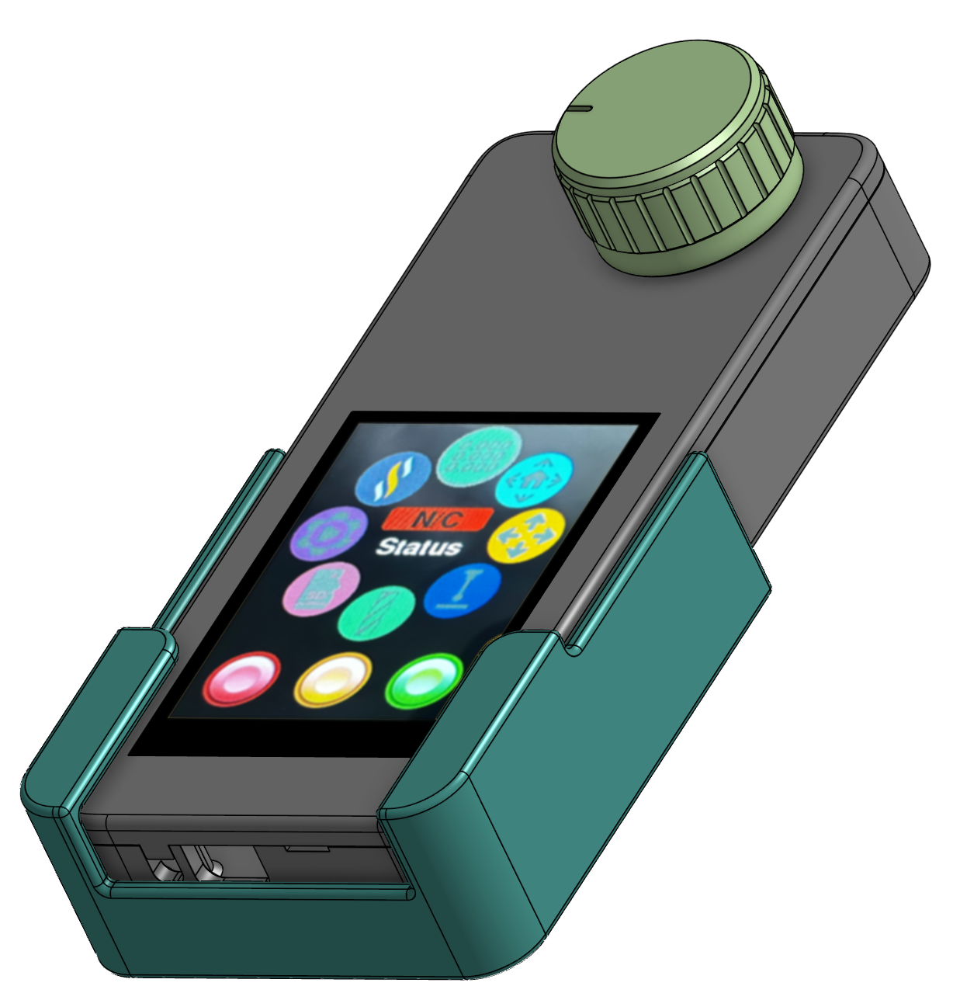
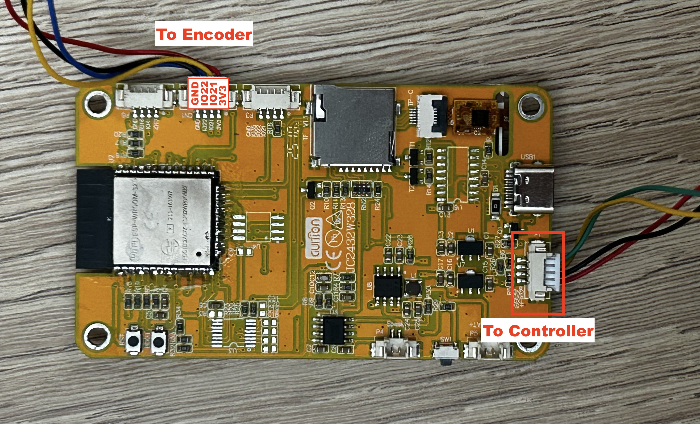
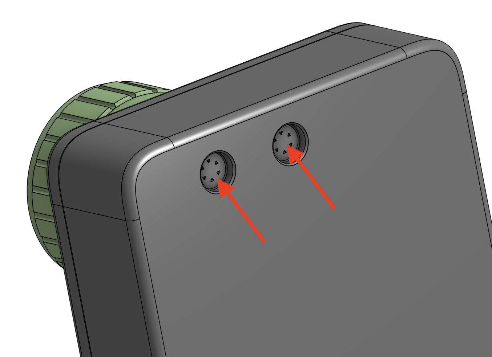
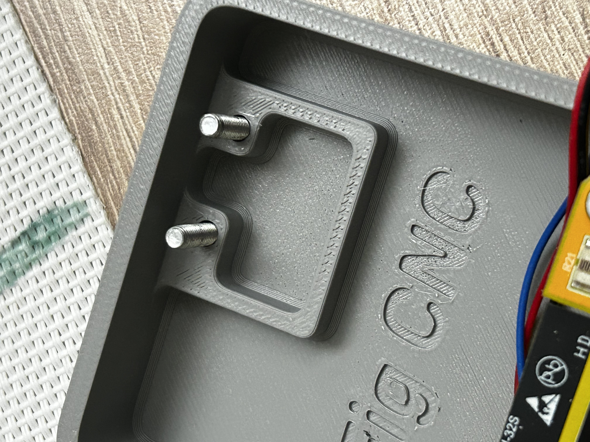
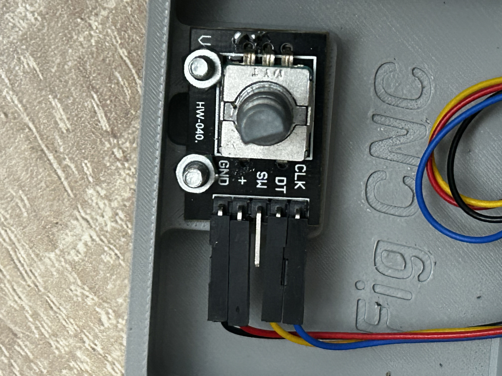
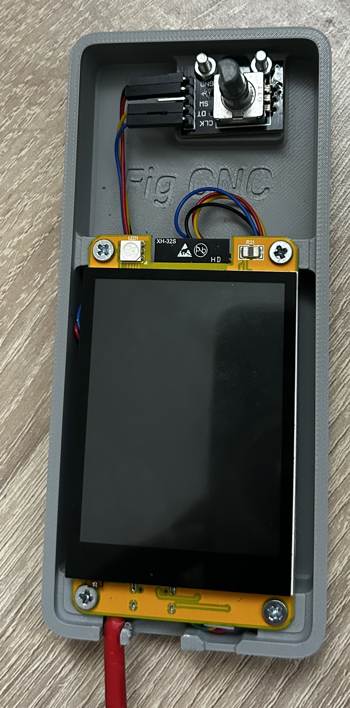
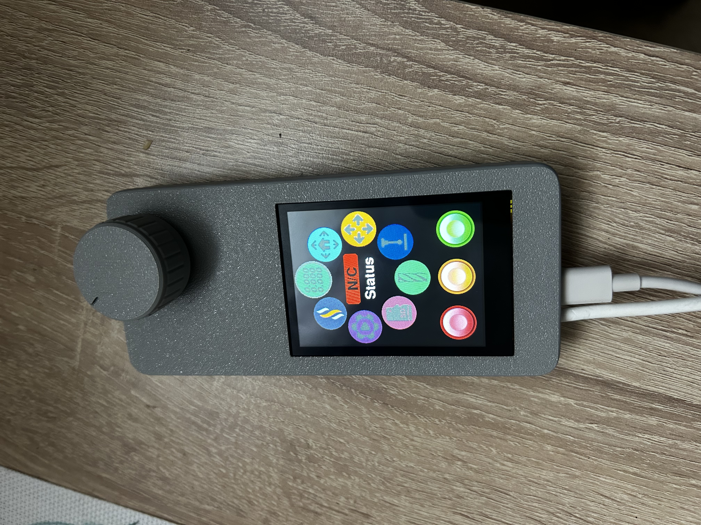

# FigCNC Pendant

A 3D-printable enclosure and cradle for a FluidNC CNC pendant, designed to fit the **Cheap Yellow Display (CYD / ESP32-2432S028R)** and a standard rotary encoder module. This project is a custom case built around [FluidDial](https://github.com/bdring/FluidDial) — all pendant functionality is provided by the FluidDial firmware; this repository contains only the printable enclosure files.

---

## Printed Parts

| File | Description |
|---|---|
| `FigCNC-Pendant-Case.stl` | Main enclosure body |
| `FigCNC-Pendant-Lid.stl` | Snap-fit rear lid |
| `FigCNC-Pendant-Knob.stl` | Knob for the rotary encoder |
| `FigCNC-Pendant-Cradle.stl` | Desktop cradle / holder |

---

## Bill of Materials

| Item | Quantity |
|---|---|
| CYD — ESP32-2432S028R (Cheap Yellow Display) | 1 |
| Rotary encoder module (HW-040 or equivalent) | 1 |
| M3 × 16 mm bolts | 2 |
| M3 nuts | 2 |
| M3 × 16 mm screws (CYD mounting) | 4 |
| 4-wire cable (to FigCNC pendant header) | 1 |

---

## Firmware

Flash the CYD with the FluidDial firmware before assembly using the web installer:

**https://installer.fluidnc.com**

Select the FluidDial target, connect the CYD over USB, and follow the on-screen instructions. No additional configuration is required beyond what FluidDial provides.

---

## Wiring

### Rotary encoder — CYD connections

Wire the encoder module to the CYD before fitting it into the case. Refer to the image below for connector locations.

| Encoder pin | CYD pin |
|---|---|
| CLK | IO22 |
| DT | IO21 |
| + | 3V3 |
| GND | GND |

### Pendant cable — FigCNC connections

Connect the pendant cable to the **J5 pendant header** on the FigCNC board.

| CYD pin | FigCNC J5 pin |
|---|---|
| TX | RX (from pendant) |
| RX | TX (to pendant) |
| GND | GND |
| 5V | 5V |

> Note: TX and RX are crossed — the CYD's transmit connects to the FigCNC receive, and vice versa.

The pendant UART on FigCNC operates at 1,000,000 baud (configured in `config.yaml`). This matches the FluidDial default and requires no changes on either side.

---

## Assembly

### Step 1 — Pierce the encoder screw holes

The two screw holes for the rotary encoder are covered by a thin layer of plastic left by the print. Use a small screwdriver or awl to pierce through the two points indicated by the red arrows, clearing the path for the M3 bolts.

### Step 2 — Insert the M3 bolts

Drop two M3 × 16 mm bolts down through the cleared holes from the outside of the case. The bolt heads will sit flush against the top surface.

### Step 3 — Mount the rotary encoder

Connect your wiring to the rotary encoder module (CLK, DT, SW, +, GND), then seat the encoder onto the bolts and fasten it from inside with M3 nuts. The encoder module should sit flat against the mounting platform.

### Step 4 — Install the CYD

Attach the data cable to the CYD's connector. Route the cable beneath the CYD, then lower the CYD into the case and fasten it using four M3 screws into the corner standoffs.

### Step 5 — Attach the lid

The lid snaps onto the back of the case. No tools or fasteners required — press evenly around the perimeter until it clicks into place.

---

*Part of the [FigCNC](../README.md) open-source CNC controller project by FIGAMORE.*
