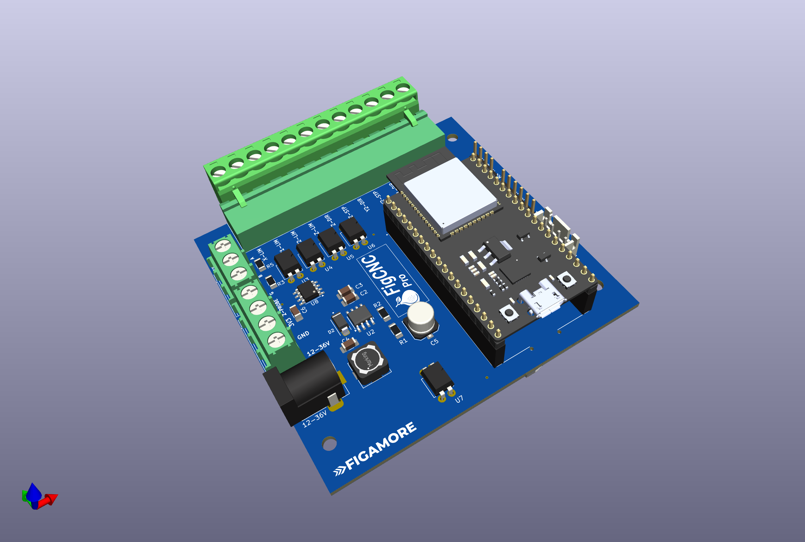
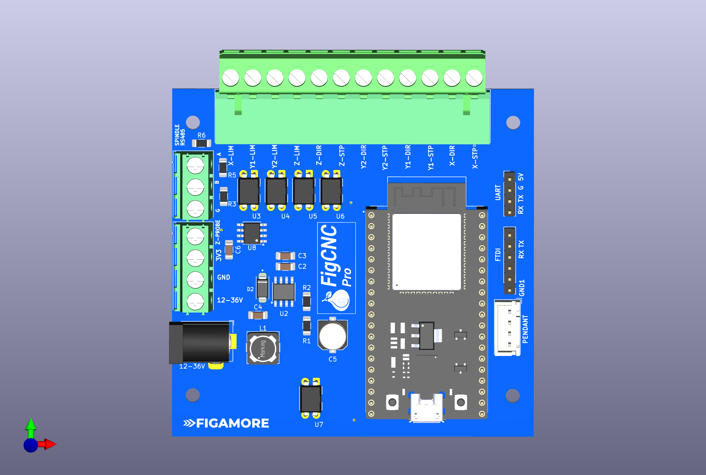
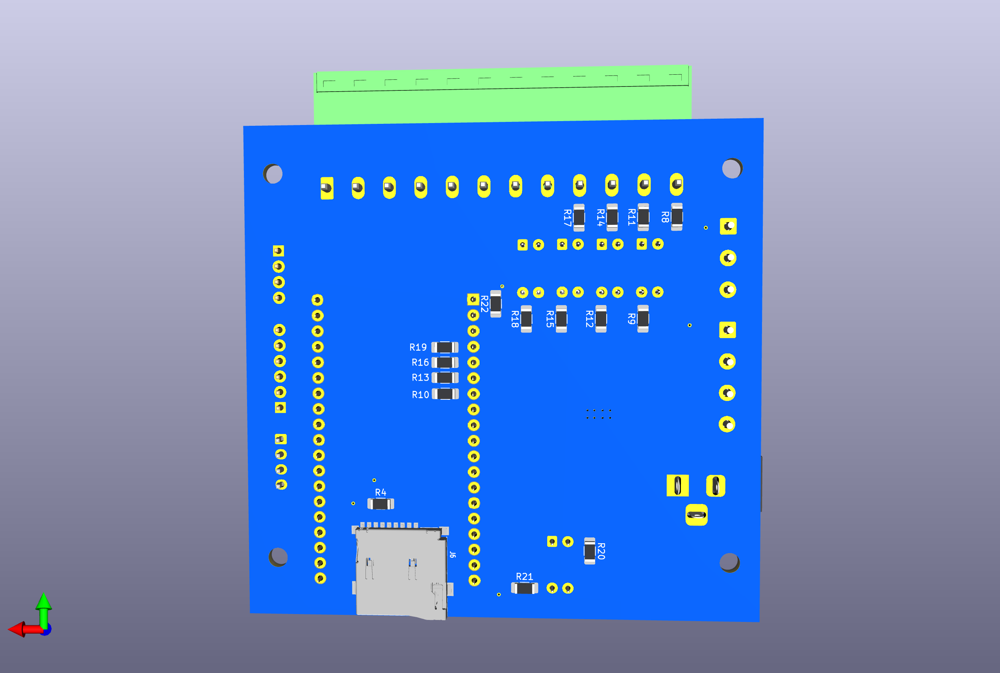
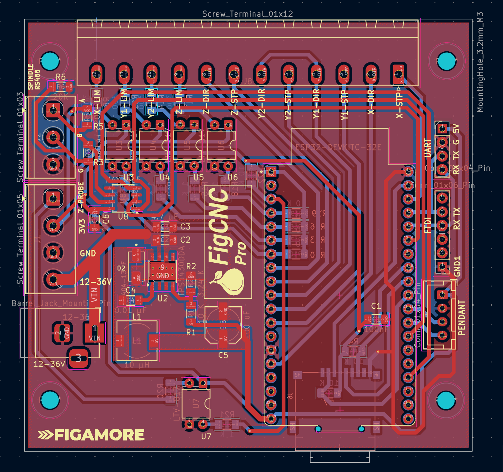
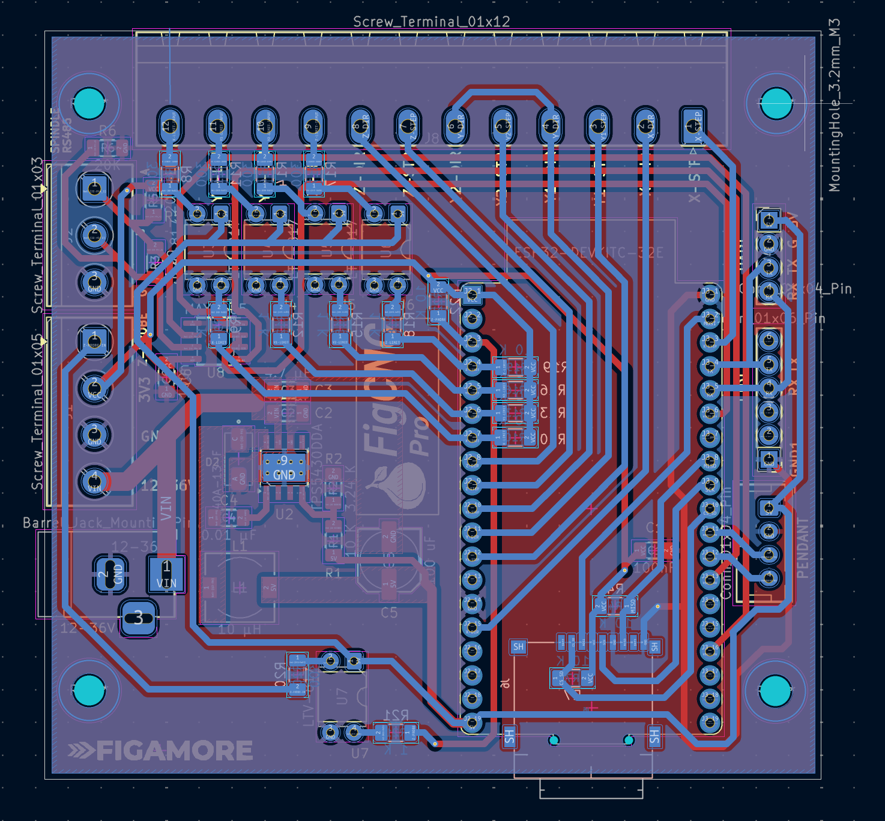

# FigCNC

**FigCNC** is an open-source CNC controller board based on the ESP32 microcontroller, designed to run [FluidNC](https://github.com/bdring/FluidNC) firmware. It provides a compact and clean interface between the ESP32 and external stepper motor drivers, with optocoupler-isolated limit switch inputs, a tool-length probe input, onboard microSD storage for G-code files, and a pendant UART interface — all powered directly from the machine's 12–36 V supply rail.

Two hardware variants are available. The **FigCNC Standard** is intended for simple CNC motion control — it manages axis movement, homing, and probing without any spindle speed control. The **FigCNC Pro** is identical in every other respect but adds an RS485 interface (MAX3485 transceiver) for direct Modbus RTU control of Huanyang-compatible VFD spindles, making it suitable for machines that require closed-loop spindle speed management.

## Table of Contents

- [Features](#features)
- [Board Overview](#board-overview)
- [Electrical Specifications](#electrical-specifications)
- [PCB Layout](#pcb-layout)
- [Manufacturing](#manufacturing)
- [GPIO Pin Reference](#gpio-pin-reference)
- [Connectors](#connectors)
- [FluidNC Configuration](#fluidnc-configuration)
- [Provided Configuration Files](#provided-configuration-files)
- [Pendant](#pendant)
- [License](#license)

 

---

## Features

- **FluidNC native** — drop-in `config.yaml` configurations are provided for each axis and spindle combination. No firmware modifications required.
- **Wide input voltage** — 12 V to 36 V DC, regulated onboard to 5 V via the TPS5430DDA synchronous buck converter.
- **Four stepper channels** — X, Y1, Y2, and Z step/direction outputs on a single 12-pin Phoenix-style screw terminal. The second Y channel enables dual-motor gantry operation with independent homing.
- **Isolated limit switch inputs** — all four limit switch inputs and the probe input pass through LTV-817 optocouplers, keeping high-voltage switch wiring isolated from the ESP32.
- **Tool-length probe** — dedicated probe input (active-low) with optocoupler isolation.
- **MicroSD card** — SPI-connected microSD socket for storing G-code files. Accessible via the FluidNC web interface or over the serial connection.
- **Pendant interface** — UART2 exposed on a JST-XH connector for connecting a wired or wireless pendant.
- **UART / FTDI header** — a 4-pin header (RX, TX, GND, 5 V) provides direct serial access for firmware flashing and debug.
- **RS485 VFD spindle (Pro only)** — the FigCNC Pro adds a MAX3485 half-duplex RS485 transceiver and a dedicated 3-pin screw terminal for direct Modbus RTU control of Huanyang-compatible VFDs, eliminating the need for a PWM-to-analog converter.
- **Compact form factor** — four M3 mounting holes, compatible with standard DIN rail brackets and CNC controller enclosures.

---

## Board Overview

### Top view — connector layout

### Rear view

---

## Electrical Specifications

| Parameter | Value |
|---|---|
| Input voltage | 12–36 V DC |
| Input connector | 2.1 mm barrel jack |
| Onboard regulated output | 5 V (TPS5430DDA, up to 3 A) |
| Microcontroller | Espressif ESP32-DEVKITC-32E |
| Stepper interface | Step/Direction (StepStick-compatible signal levels) |
| Step pulse width | 10 µs (configurable in FluidNC) |
| Direction setup delay | 6 µs |
| Motor idle timeout | 250 ms |
| Limit / probe isolation | LTV-817 optocoupler (×5) |
| RS485 transceiver (Pro) | Maxim MAX3485, 120 Ω termination fitted |
| MicroSD interface | SPI, up to 4 MHz |

---

## PCB Layout

| Front copper | Back copper |
|---|---|
|  |  |

The full schematic is also available as a [PDF](FigCNC-Pro/schematic/FigCNC-Pro-Schematic.pdf).

---

## Manufacturing

All files required for PCB fabrication and assembly are included in each board's subdirectory.

| File type | Location |
|---|---|
| Gerber files (fabrication) | `FigCNC-Standard/gerbers/` / `FigCNC-Pro/gerbers/` |
| Drill files (.drl) | Included in gerbers directory |
| Bill of materials (CSV) | `FigCNC-Standard/FigCNC-Standard.csv` / `FigCNC-Pro/FigCNC-Pro-BOM.csv` |
| Pick-and-place positions | `FigCNC-Standard/FigCNC-Standard-all.pos` / `FigCNC-Pro/FigCNC-Pro.pos` |
| Schematic (PDF / SVG) | `FigCNC-Standard/schematic/` / `FigCNC-Pro/schematic/` |

The Gerber files have been validated for standard 2-layer PCB fabrication. The board can be ordered from any standard PCB manufacturer (e.g. JLCPCB, PCBWay, OSH Park) using the provided files without modification.

---

## GPIO Pin Reference

All GPIO assignments below correspond to the provided `config.yaml` files and the board's fixed routing. They should not be changed unless the PCB is modified.

| Signal | ESP32 GPIO |
|---|---|
| X — Step | 22 |
| X — Direction | 13 |
| X — Limit (positive) | 32 |
| Y1 — Step | 14 |
| Y1 — Direction | 27 |
| Y1 — Limit (positive) | 35 |
| Y2 — Step (dual-Y only) | 26 |
| Y2 — Limit (positive, dual-Y only) | 34 |
| Z — Step | 25 |
| Z — Direction | 33 |
| Z — Limit (positive) | 39 |
| Probe (active-low) | 36 |
| SPI MISO | 19 |
| SPI MOSI | 23 |
| SPI SCK | 18 |
| MicroSD CS | 5 |
| UART1 TX — VFD RS485 (Pro only) | 15 |
| UART1 RX — VFD RS485 (Pro only) | 4 |
| UART1 RTS — VFD RS485 (Pro only) | 21 |
| UART2 TX — Pendant | 17 |
| UART2 RX — Pendant | 16 |

---

## Connectors

### J8 — Stepper motor interface (12-pin Phoenix screw terminal, 5.08 mm pitch)

This is the primary stepper output terminal. Connect each signal to the corresponding input of your external stepper drivers (e.g. TB6600, DM542, or similar).

| Pin | Signal | Notes |
|---|---|---|
| 1 | X-LIM | X-axis limit switch (optocoupler input) |
| 2 | Y1-LIM | Y1 limit switch (optocoupler input) |
| 3 | Y2-LIM | Y2 limit switch (optocoupler input, dual-Y only) |
| 4 | Z-LIM | Z-axis limit switch (optocoupler input) |
| 5 | Z-DIR | Z direction output |
| 6 | Z-STP | Z step output |
| 7 | Y2-DIR | Y2 direction output (dual-Y only) |
| 8 | Y2-STP | Y2 step output (dual-Y only) |
| 9 | Y1-DIR | Y1 direction output |
| 10 | Y1-STP | Y1 step output |
| 11 | X-DIR | X direction output |
| 12 | X-STP | X step output |

### J2 — RS485 spindle (3-pin Phoenix screw terminal, 5.00 mm pitch) — Pro only

Connect to the RS485 terminals of a Huanyang-compatible VFD. A 120 Ω termination resistor is fitted on the board.

| Pin | Signal |
|---|---|
| 1 | A (+) |
| 2 | B (−) |
| 3 | GND |

### J5 — Pendant (JST-XH 4-pin)

| Pin | Signal |
|---|---|
| 1 | 5 V |
| 2 | GND |
| 3 | RX (from pendant) |
| 4 | TX (to pendant) |

### J4 — UART / FTDI header (2.54 mm pitch, 4-pin)

| Pin | Signal |
|---|---|
| 1 | RX |
| 2 | TX |
| 3 | GND |
| 4 | 5 V |

### Probe input

The probe input is located on the left-side screw terminal block (J1). Connect the probe to the designated probe pin and GND. The input is active-low and optocoupler-isolated.

---

## FluidNC Configuration

FigCNC runs [FluidNC](https://github.com/bdring/FluidNC), an ESP32-based CNC firmware compatible with G-code senders such as [FluidDial](https://github.com/bdring/FluidDial), [CNCjs](https://cncjs.org), [UGS](https://winder.github.io/ugs_website/), and [Candle](https://github.com/Denvi/Candle).

Configuration is done via a single `config.yaml` file stored on the ESP32 (uploaded via the FluidNC web interface or over serial). Ready-to-use configuration files are provided for each supported machine topology.

### Default axis parameters

These values match the provided configurations and serve as a reference starting point. **You must adjust `steps_per_mm`, `max_rate_mm_per_min`, `acceleration_mm_per_sec2`, and `max_travel_mm` in the config file to match your specific machine geometry, lead screw pitch, microstepping settings, and motors before running the machine.**

| Axis | Steps/mm | Max rate (mm/min) | Acceleration (mm/s²) | Max travel (mm) |
|---|---|---|---|---|
| X | 320 | 2500 | 100 | 327 |
| Y | 400 | 3000 | 100 | 327 |
| Z | 320 | 1600 | 100 | 95 |

### VFD spindle parameters (Pro with-VFD configs)

| Parameter | Value |
|---|---|
| Protocol | Huanyang Modbus RTU |
| Baud rate | 9600 |
| Modbus ID | 1 |
| Speed map | 0–25% → 0 RPM, 25–100% → 6000–24000 RPM |

---

## Provided Configuration Files

Pre-built `config.yaml` files are included for the following machine topologies. Upload the appropriate file to the ESP32 using the FluidNC web interface or over serial before running the machine.

### FigCNC Standard

| Configuration | Path |
|---|---|
| Single Y-axis motor | `FigCNC-Standard/configs/single-y-axis/config.yaml` |
| Dual Y-axis motors (gantry) | `FigCNC-Standard/configs/double-y-axis/config.yaml` |

### FigCNC Pro

| Configuration | Path |
|---|---|
| Single Y-axis, no VFD | `FigCNC-Pro/configs/single-y-axis-no-vfd/config.yaml` |
| Single Y-axis, with Huanyang VFD | `FigCNC-Pro/configs/single-y-axis-with-vfd/config.yaml` |
| Dual Y-axis, no VFD | `FigCNC-Pro/configs/double-y-axis-no-vfd/config.yaml` |
| Dual Y-axis, with Huanyang VFD | `FigCNC-Pro/configs/double-y-axis-with-vfd/config.yaml` |

---

## Pendant

FigCNC is designed to work with a 3D-printable pendant enclosure for the [FluidDial](https://github.com/bdring/FluidDial) CNC pendant, built around the Cheap Yellow Display (CYD / ESP32-2432S028R). The enclosure files, assembly instructions, and wiring reference are included in this repository.

See the [FigCNC Pendant README](FigCNC-Pendant/README.md) for full details.

---

## License

This project is licensed under the **CERN Open Hardware Licence v2 - Permissive (CERN-OHL-P v2)**. You are free to use, modify, and manufacture the hardware for personal and commercial purposes, with or without releasing your modifications, provided attribution is maintained.

See [LICENSE](LICENSE) for full terms. This project is not affiliated with FluidNC or FluidDial — it is simply designed to run their firmware.

> [!CAUTION]
> This hardware is provided as-is. Use at your own risk. The developer accepts no responsibility for any damage to equipment, property, or injury arising from the use, assembly, or operation of this project.

---

*Designed by FIGAMORE.*
